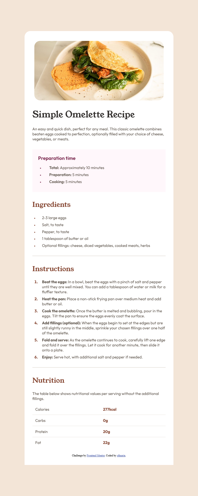
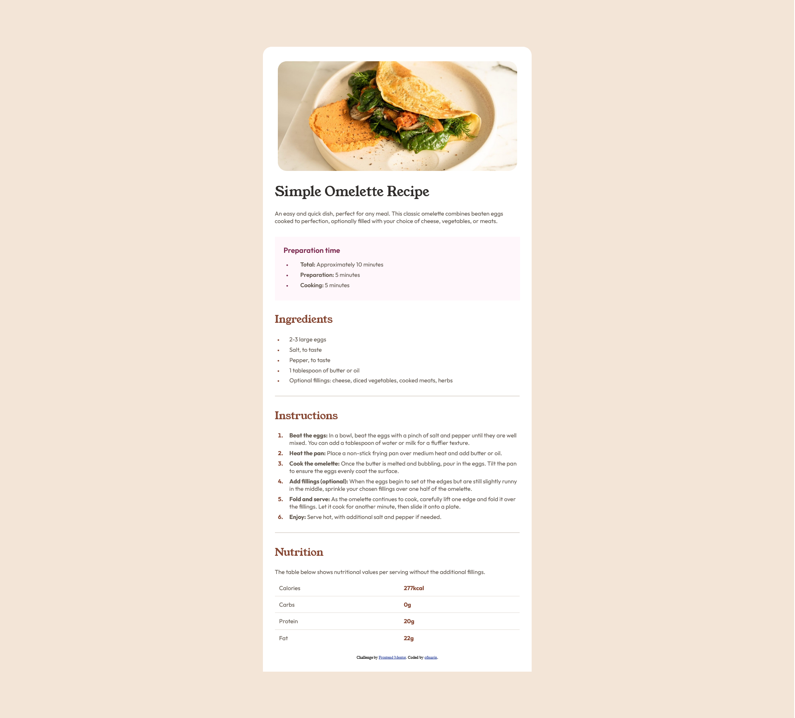
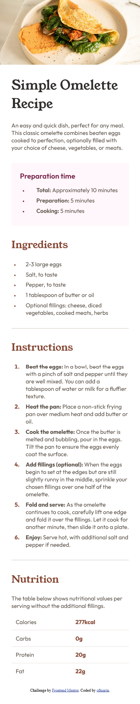

# Frontend Mentor - Recipe page solution

This is a solution to the [Recipe page challenge on Frontend Mentor](https://www.frontendmentor.io/challenges/recipe-page-KiTsR8QQKm). Frontend Mentor challenges help you improve your coding skills by building realistic projects. 

## Table of contents

- [Overview](#overview)
  - [The challenge](#the-challenge)
  - [Screenshot](#screenshot)
  - [Links](#links)
- [My process](#my-process)
  - [Built with](#built-with)
  - [What I learned](#what-i-learned)
  - [Continued development](#continued-development)
  - [AI Collaboration](#ai-collaboration)
- [Author](#author)

## Overview

### Screenshot

  
📸 Click to view application screenshots

  
  
  

### Links

- Solution URL: [Github](https://github.com/ofmarin/recipe-page)
- Live Site URL: [GH pages](https://ofmarin.github.io/recipe-page/)

## My process

### Built with

- Semantic HTML5 markup
- CSS custom properties(barely)
- Flexbox
- Mobile-first workflow
- [Angular](https://Angular.dev) - JS library

### What I learned

- Remember the use of media queries.
- How to add components to the root component.
- Getting more comfortable with Starting with mobile first.

### Continued development

- What can I say, I want to learn more angular, although so far its been more
  css focused.

- Reducing AI help where I can.

### AI Collaboration

- Gemini
- This time helped me with markdown for the readme, explaining angular concepts, bouncing off ideas

- What worked well? What didn't?

## Author

- Frontend Mentor - [@ofmarin](https://www.frontendmentor.io/profile/ofmarin)
